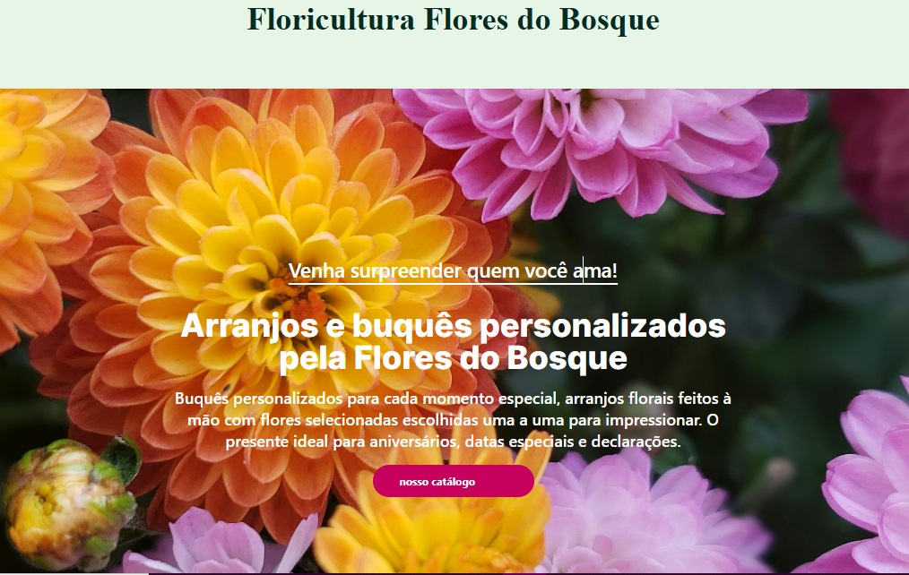

# Floricultura Flores do Bosque

## 🌿 Sobre o Projeto

Este projeto é uma Landing Page para a **Floricultura Flores do Bosque**, desenvolvida para apresentar arranjos florais e buquês personalizados. O site oferece uma experiência visual agradável, destacando a diversidade de produtos e a qualidade do serviço.

## 🚀 Tecnologias Utilizadas

- React
- TypeScript
- Vite
- Tailwind CSS

## ✨ Funcionalidades

- **Apresentação de Produtos:** Galeria com diferentes tipos de flores (Rosas, Girassóis, Tulipas, etc.).
- **Chamada para Ação:** Botão para conferir o catálogo via WhatsApp.
- **Informações de Qualidade:** Destaque para o frescor e cuidado com as flores.
- **Design Responsivo:** Layout adaptável para dispositivos móveis e desktop.

